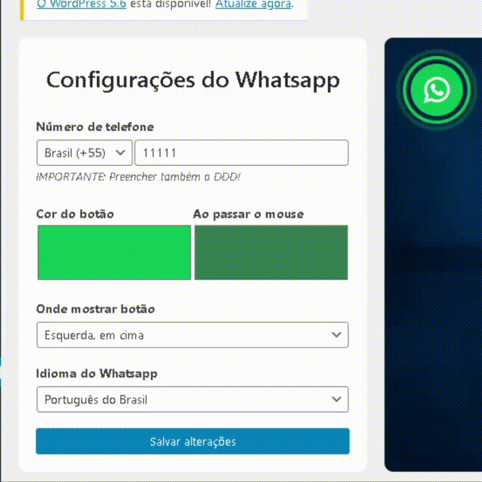
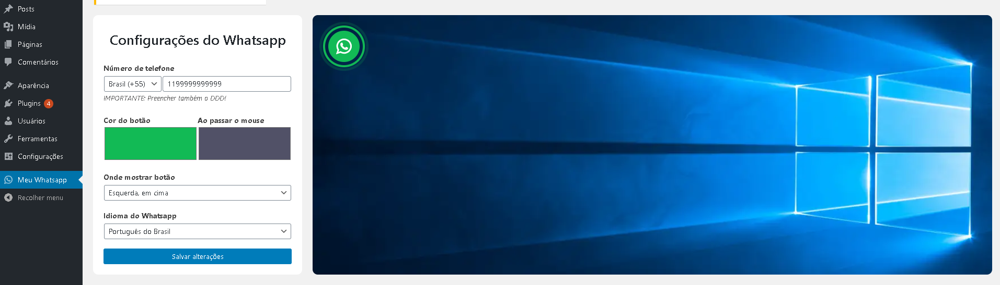
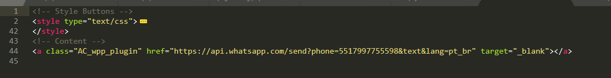

# Whatsapp_Plugin
Botão animado costumizavel para direcionar acessos a api do Whatsapp. 

# Wordpress
Instalando a pasta 'AC_Whatsapp_Plugin' como plugin no Wordpress, se abrirá no menu uma sessão para configuração semelhante a esta: 

# Site Comum
Copiando os arquivos disponiveis na pasta 'AC_Whatsapp_Web' é possivel obter o mesmo resultado para sites Web que não possuem Wordpress intalado. 

